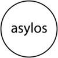

# 2015 Retrospective

## who we are
We are a team of 12 strategists, researchers, technologists, and advocates based in 9 countries. The internet is our office. We forge partnerships with social change organizations and work with them to tactically and strategically adopt technology to further their social justice objectives. We work to make a tangible and positive difference for our partners while producing reusable documentation and resources to make a positive difference for other organizations that we do not directly support. 

### Our Mission
The engine room exists to accelerate positive social change. We do this by supporting social change initiatives to effectively use technology and data in their work.  

_We define __positive social change__ as shifts in society that promote equality, access to justice, exercise of rights, good governance, and accountability. We believe that because we are untethered from a particular social change sector we are better able to circulate effective strategies, provide demand-driven support, and bring fresh ideas and approaches that can have a big impact._

## how did we work towards our mission in 2015?

* We grew the number of organizations we supported from 41 to 63
* We supported the development of 12 data and technology projects in transparency, accountability, human rights, and governance
* We produced 25 blog posts documenting approaches to common data and technology challenges
* We held 2 Responsible Data Forums to support collaborative thinking about RD challenges and actively supported 9 other responsible data-focused offline and online events
* We organized and facilitated 10 events to support collaborative program design and community development for organizations and networks
* We grew our team from 10 to 12 to address growing demand and further our reach
* We successfully increased interest in tackling responsible data challenges
* We built and completed the pilot of our Matchbox approach with 6 partnerships
* We developed our organizational security support work from a loose set of engagements to a consolidated process
* We fine-tuned our ability to produce high quality problem-solving and program design support to organizations big and small
* We added three new board members to help with our strategic direction and organizational management

Scroll through to learn more about our programmatic activities, research, network of allies and events in 2015.

## our main programs

You’ll find threads of our two major programs running through much of our work - we try to engage in long-term direct support as a general rule, and we also try to integrate responsible data thinking into all of our partnerships, projects, and research.

### Responsible Data Program

Our Responsible Data Program is focused on making it easier for advocacy organizations to use data responsibly. Part of the Responsible Data Program, the Responsible Data Forum convenes activists, advocates, security thinkers, researchers and technology doers, for learning and building sprints. We've had a few significant developments in the past year, including: hiring of a Responsible Data Program Manager (Danna Ingleton) and a re-conceptualization of program delivery.

### Matchbox

Our Matchbox Project is built to match high impact advocacy projects with the network of technical and strategic expertise they need to build effective technology that powers their work. In the course of 2015, we engaged with over 30 organizations to provide light-touch strategic advice, and with 5 partners to provide in-depth technical and strategic support in concentrated periods (ranging from 6 to 12 months).

## what we did this year

### Direct Support

Our direct support to partners is a critical part of our work. It creates impact and it keeps us connected to the real world problems organizations are facing so we can better target our research and programmatic activities.

### Responsible Data Program

#### OXFAM 
We worked with OXFAM as they developed and launched their updated responsible data institutional policy. This was ‘light touch’ direct support that involved reviewing and commenting on drafts, making helpful connections within the community and being available to discuss thorny areas of the policy.

#### Shelter Me
We’re working with Shelter Me, a project developing an SMS phone tree for Indonesian migrant domestic workers in the Gulf Region. We facilitated a half day session with the funder and project partners to unpack responsible data issues related to this phone tree, and to develop mitigation strategies. Of particular interest is that we used a responsible data framework to plan out the project, rather than attempting to shoehorn responsible data into an existing project plan.

#### Medecins Sans Frontieres 
We are embarking on a project with Medecins Sans Frontieres to review and update their data sharing policies and implementation tools. The importance of this work lies in the intrinsic value of opening medical data and data from field research to support humanitarian interventions and medical research, studies, publications and ultimately service delivery.

#### Amnesty International
We are working with Amnesty International and Benetech to spearhead a community discussion on these issues, taking into consideration all that has been done to date. We will develop a helpful resource to both bring consistency in present responses and to ensure that human rights practitioners are well positioned to proactively address responsible data issues as they emerge.

We also led a responsible data and program design workshop for Amnesty International to help them prepare for their microtasking project.

#### Mercy Corps
We have worked with Mercy Corps to develop tip sheets for RD issues related to e-transfers. We are initially drafting 2 tip sheets (on Encryption and Data Minimisation) and will hopefully be contributing to the development of a broader Data Starter Kit for humanitarian field staff working on e-transfer programmes.

### Matchbox Partners

#### Fundacion Directorio Legislativo (Argentina)
An organization that uses dialogue, transparency and access to public information to promote democracy and a stronger parliament. We supported the development of a website to show changes made to bills and the parliamentarians who promoted these changes. We wrote about this work [here](https://www.theengineroom.org/turning-an-idea-into-an-action-plan-documenting-our-work-with-directorio-legislativo/).

#### ¿Quién Compró? (Mexico)
An online platform investigating how the Mexican congress spends public funds. The site shows where and on what public money is being spent. We facilitated improvements to the website to allow for more effective collection, uploading and downloading of receipts obtained through freedom of information laws. [We wrote about the process of creating a microtasking site](https://www.theengineroom.org/behind-the-scenes-how-we-helped-kick-start-a-microtasking-site/), and [digitizing documents](https://www.theengineroom.org/what-were-learning-about-digitizing-and-preserving-documents/). 

#### Research and Advocacy Unit (Zimbabwe)
A research organization focusing on issues related to women, displacements and governance. We helped to set up a citizen reporting platform using FrontlineSMS to collect citizen voices on MPs’ participation in parliament, and captured and recorded this information in a database, linking the database to individual MP profiles and a public interface for dissemination. We wrote about it [here](https://www.theengineroom.org/harnessing-tech-to-monitor-mps-attendance-and-engagement-in-zimbabwe/).

#### Kubatana (Zimbabwe)
A civic human rights information and advocacy organisation that provides and makes accessible online a range of human rights and public interest documents. We helped the organization develop a tool  to collect and categorize citizen reports on water availability throughout Harare. We wrote about our experience using WhatsApp for this project [here](https://www.theengineroom.org/what-were-learning-about-using-whatsapp-in-advocacy-initiatives/).

#### Institute for Public Policy Research (Namibia)
A research organization that delivers independent, analytical, critical and constructive research into social, political and economic issues affecting development in Namibia. Matchbox is providing support in the mapping of information related to the allocation of Petroleum Exploration Licenses in the country in an effort to increase transparency in the sector. Part of our support also included the development of an online platform that includes data visualisations where the public can view raw data and basic analysis of trends in the licensing
process.

#### Ndifuna Ukwazi (South Africa)
A team of advocates based in Cape Town, South Africa. They use research and strategic litigation to campaign for justice and equality in poor and working class communities. Matchbox helped NU build a platform that monitors the accessibility of municipalities’ service delivery agreement contracts and other public information, and compares municipalities’ compliance on FOI laws against each other. We wrote about it here. The website is available [here](http://muni.compliancetracker.org.za/).

### Other Project-based, holistic, strategic and technical support

Our direct support to partners is a critical part of our work. It creates impact and it keeps us connected to the real world problems organizations are facing so we can better target our research and programmatic activities. Our direct support activities can be grouped according to two main types: project-based, holistic strategic and technical support, and supporting partners to design engagement with their communities in workshops. 

In the course of 2015, we have developed a set of core services that we can provide to organizations looking for support to integrate technology into their work. We deliver direct support on a sliding-scale fee.

#### Amnesty International
The engine room team has been working with Amnesty International for three years on a variety of projects. In 2015, we finalized our work to support their redesign of the in-house human rights defender database, Alix joined AI’s new Technology and Human Rights Advisory Group, and we have begun program design support on several new initiatives including Alt Click.

#### Alt Click
Amnesty International has recently started a program to leverage volunteer microtasking (link to blog post about what microtasking is) to support their human rights documentation and research processes. This is no small effort to design an effective program that uses technology to great effect while also addressing head-on the responsible data challenges of including the public in sifting and categorizing large amounts of human rights documentation. To support Amnesty in the design phase of Alt Click, we researched existing microtasking initiatives and technology providers to develop a set of recommendations and background information on the state of the art in microtasking; we also facilitated a program design sprint to support the development of a clear pilot case for Alt Click. We will continue working with the Alt Click team to support them as they work to use new tools to enrich their volunteer engagement and expand their research capabilities. 

#### Panic Button
We worked with Amnesty International and media activist [Mushon Zer-Aviv](http://mushon.com/) to create the [Panic Button Training Kit (PACT)](http://the-engine-room.github.io/PACT-kit/), a collection of training tools for human rights defenders at risk. We wrote about this work [here](https://www.theengineroom.org/from-a-button-to-a-pact-scaling-security-through-design/).

#### SumofUs
The engine room team works with [SumofUs](http://sumofus.org/), the campaigning organization, to improve its team security practices. Moving beyond technical fixes and end-user tool trainings, we’ve been working with SumofUs to develop organization-wide behavior change that powers the organization’s mission of holding corporations accountable to citizens.

#### Rainforest Foundation
We have continued our work with the [Rainforest Foundation of Norway](http://www.regnskog.no/en/) to support their partners in developing strategic skills for adopting data and technology in national-level advocacy to protect forests and individuals’ rights. We produced an introduction to using technology tools such as drones, satellite mapping and mobile data collection (to be published shortly), and conducted research on how advocacy organisations can produce data that socially responsible investors could use to influence companies’ activities. The Rainforest Foundation supports programs that cover a range of issues from protection of civil and political rights of indigenous and tribal peoples, to the promotion and defense of their social, economic and cultural rights.

#### DataShift
The engine room has continued its work with CIVICUS on the [DataShift](http://civicus.org/thedatashift/) initiative. The engine room team has been supporting in: design and implementation of targeted support to organisations collecting and using citizen-generated data in four pilot countries (Argentina, Nepal, Tanzania, and Kenya), research on the impact that citizen-generated data projects can have, and creating reusable resources on how to successfully develop citizen-generated data projects that can have real impact at national and international levels. CIVICUS is an international alliance dedicated to strengthening citizen action and civil society around the world.

#### Restart Project
We developed a platform for the [Restart Project](https://therestartproject.org/) to provide visual information about the impact that Restart Parties have on the amount of e-waste participants produce. This work is intended to connect monitoring and evaluation approaches with data-informed, visual advocacy tools.

#### Asylos
Last year, we supported [Asylos](http://asylos.eu/) to develop its new data sharing tool for the decentralized research team that powers its support to refugees. This year we helped design and facilitate Asylos’ all-network event in Berlin. We supported them to incorporate diverse topics ranging from creative campaigning techniques (featuring Peng!), creative research techniques (featuring the Transparency Toolkit), Asylum Law 101 (featuring the Refugee Law Clinic of Munich), and other sessions on country of origin information standards, responsible data and information security.

#### Level Up
We're working with the [LevelUp](https://www.level-up.cc) team at Internews to overhaul their platform and improve mechanisms for contribution and localization. LevelUp is a resource for training of trainers (ToT) and supports individuals and groups providing digital security trainings worldwide.

#### Code for Pakistan
We worked with [Code for Pakistan](http://codeforpakistan.org/) to improve volunteer engagement and onboarding; better manage organizational information; and use tools and techniques to more effectively manage roadmaps, goals, and day-to-day work between an international, distributed team. Code for Pakistan is a technology focused non-profit building a non-partisan civic innovation ecosystem to improve quality of life across Pakistan.

#### Data Centar
[Data Centar](http://datacentar.io) aims to provide a fully functional MVP (minimum viable product) for an open, searchable online platform of financial and administrative data on public officials, at a national and local level in Serbia. 

#### Zimbabwe Peace Project
Brokering [Zimbabwe Peace Project](https://en.wikipedia.org/wiki/Zimbabwe_Peace_Project) website penetration testing (from Cure53, funded by OTF) and migration to Greenhost.

We provided light-touch strategic support in response to requests from 30 organizations through the Matchbox project and other avenues ranging from questions about designing pilots using SMS feedback mechanisms, facilitating audience research and design of wireframes to inform future web development. 

## how did we do this?

### By bringing people together

In 2015, the engine room has partnered with 6 organizations to host 2 Responsible Data Forum events. We also worked with 5 practitioners with responsible data expertise to host 4 online, peer-to-peer discussions. Here’s a brief summary:

* The [RDF on Human Rights Documentation](https://responsibledata.io/forums/human-rights-documentation/) (Manila, March) brought together 30 human rights practitioners and researchers to explore the ethical, privacy and security challenges posed by the use of data and new technologies in human rights documentation. We hosted this event in partnership with: Amnesty International, Benetech, HURIDOCS, and the Center for Social Cultural Rights. 
* The [Responsible Data Lab for documentary photographers and photojournalists](https://responsibledata.io/forums/responsible-data-lab-photography/) (New York, March) was a 1-day hands-on lab that exposed 30 photographers and photojournalists to approaches for navigating the ethical, privacy and security challenges they face in their work, and in today’s rapidly shifting digital landscape. We hosted this event in partnership with the Magnum Foundation and Open Society Foundation. 
* Over __300 practitioners__ have joined the [RDF email discussion](http://lists.theengineroom.org/lists/info/responsible_data) list and sent over 100 messages to learn from their peers and share their experiences and knowledge with others in this growing community.
* The RDF online discussion series on de-identifying data engaged over 40 participants in four events. All of these online events produced meaningful resources for the RDF community:
	* Our [first discussion with Mark Elliot](https://responsibledata.io/de-identifying-data-an-introduction-for-advocacy-organisations-a-summary-of-the-discussion/) of the UK Anonymisation Network was an introduction to de-identifying data for advocacy organisations. 
	* Our [second discussion with Sara-Jayne Terp](https://responsibledata.io/summary-of-our-discussion-on-the-risks-and-mitigations-of-releasing-data/) of Thoughtworks focused on risk analysis and mitigation strategies. 
	* Our [third discussion featured Max Shron](https://responsibledata.io/summary-of-our-discussion-on-k-anonymity-and-other-de-identification-frameworks/), of Polynumeral, who presented an introduction to k-anonymity and other de-identification frameworks. 
	* Our fourth discussion was a working session with Amy O’Donnell of Oxfam on developing a data-deposit decision-making framework.	 	 	

We also played an active role in these responsible data-focused events:

* [Responsible Data for Humanitarian Response](http://www.responsible-data.org/programme.html): maximising benefits and minimizing risks.  Netherlands. Held in Feb 24-25, we were happy to support the Dutch Ministry of Foreign Affairs, Leiden University, and other partners. It gave us a great opportunity to connect with many Responsible Data partners and allies, and we were happy to run a session, and we wrote more about it [on the blog](https://responsibledata.io/responsible-data-challenges-in-humanitarian-and-advocacy-organisations-what-are-the-differences/).
* In Berlin, with [Oxfam GB](https://www.oxfam.org.uk), we coordinated a closed roundtable for organizations developing and implementing organizational responsible data policies. More info on this event is [in our blog](https://responsibledata.io/report-back-closed-roundtable-on-organizational-responsible-data-policies/). 
* RDF Balkans, October 15 - in partnership with the [Youth Initiative for Human Rights](http://yihr.hr/hr/), we organised the first geographic Responsible Data Forum, to  Building awareness of responsible data issues when using data. 
* Big Data for Peace Summer School, which is a Leiden University course for students and professionals interested in understanding ‘big data’ in international peace and justice work.
* RDF w/ Youth initiative for Human Rights

Another important part of our partner support is designing and leading events that support our partners' networks, programs, and opportunities for collaboration and capacity development. In 2015, we organized and facilitated many events for close partners to further that work, and played a supportive role in many others.

* [The POINT conference](http://point.zastone.ba/) (Sarajevo, 20-24 May 2015) was a regional conference of CSOs from across Southeast Europe and international experts, all of whom intensively use technologies in their work. We were there to talk digital security and privacy on the internet, [our work with the Matchbox project](https://thematchbox.io/), and the Data Academy datathon.
* We actively participated in a 5-day design workshop with the Balkan Data Academy to support the strategic development of a citizen election monitoring project in Bosnia. We wrote about it [here](https://www.theengineroom.org/from-election-monitoring-to-point-the-engine-room-does-the-balkans/).
* We were an organizing partner in the Responsible Data for Humanitarian Response event led by Leiden University’s Peace Informatics Lab and held at the Dutch Ministry of Foreign Affairs
* Human Rights Defenders Funders Security Event, we facilitated an event for small human rights funders in Scandinavia who are interested in providing more strategic security support for their grantees. 
* We co-facilitated a session at Monitoring Evaluation and Learning Technology ([MERL Tech](http://merltech.org/)) 2015 based on our tool selection research.
* We supported CIVICUS in their organization of events related to the DataShift program at the Cartagena Data Festival.
* We presented at and facilitated two events organised by the UK non-profit network Bond, focusing on responsible data issues in relation to monitoring and evaluation, as well as consent and data usage.
* We co-facilitated a session at the Buntwani event, which focused on the usage of technology in transparency and accountability.
* TALearn event in Delhi - as the follow up from some research we’ve been doing for the Transparency and Accountability Initiative into social movements, we facilitated a workshop for them bringing together project partners to co-create a research agenda for future work. More on the research is below. 
* We attended the [International Anti-Corruption Conference (IACC)](http://iacconference.org/) in Malaysia and helped out with their [Technology Hub](https://16iacc.sched.org/list/descriptions/type/technology+hub#.VgmZGuSgwYw). Interested attendees could approach technologists to ask a question, pitch an idea, figure out how to analyse a dataset or simply find out what tools may be available to use for their project. There’s more info about this [in our blog](https://www.theengineroom.org/how-technology-is-used-to-fight-impunity-our-take-aways-from-the-international-anti-corruption-conference/).

### By matchmaking

We could not have accomplished what we did this year without the support of our worldwide network of allies and organizations. In 2015, our legion of experts spent countless hours designing and developing platforms, resources and strategies for each of our partner’s projects. Other allies are tirelessly working to introduce responsible data practices into their organizations and work with the community to improve existing resources.

We hope to continue to invest and grow this network of experts in the coming year.

We have been fortunate to work with some of the best and the brightest to help support our Matchbox partners:

* [Julie Lorch](http://julielorch.com/) designed wireframes for a service delivery agreement website for our partner Ndifuna Ukwazi in South Africa, and IPPR in Namibia. She has also helped us on several other projects this year and has helped us up our UX and UI game. 
* [Friedrich Lindenberg](https://twitter.com/pudo) worked (with our partner the Institute for Public Policy Research) to develop a data model on petroleum exploration licenses awarded by the Namibian government. He also did volunteered to scrape data from a map showing the location of government licenses for oil which has strengthened the overall project.
* [Gertrude Nicole Friedman](https://twitter.com/friedman_gn) volunteered with one of our partners to help get 50,000 paper receipts in order and digitized. She drew up a great set of recommendations on scanning and storing paper documents. Who knew you could develop presets for a scanner to make bulk scanning more consistent?
* Don Hubert provided in-depth support for data modelling, data collection and was a rich source of information for our partner the Institute for Public Policy Research in Namibia.
* Toby Marsden worked with us to engineer a database of contract data for The Institute for Public Policy Research in Namibia and was able to capture the complex data model for the project effectively.
* [Frontline SMS](http://www.frontlinesms.com/) assisted us in setting up 2-way SMS messaging service for a partner that would allow users to report on the conduct of MPs in the Zimbabwean parliament.
* [Georges Labreche](https://twitter.com/georgeslabreche) & [Open Data Kosovo](http://opendatakosovo.org/) continue to work with us and our partner to create a microtasking platform where users can tag data on government spending.
* [Code for South Africa](http://code4sa.org/) developed the website for Ndifuna Ukwazi that ranks municipalities according to their compliance with freedom of information laws.
* [Women Hack For Non Profits](http://womenhackfornonprofits.com/) contributed tremendous volunteer work hours with women in their network to develop the frontend  for the  IPPR platform. They also built functionality to be able to integrate mapping data from the Namibian mining cadastre.
* The Fair-Play Alliance donated valuable time to advise one of our partners on building up a network of volunteers and has contributed to our learning about microtasking sites.

We also were supported by RDF community leaders who led panels and discussions at events with their networks:

* [Tania Lee](https://twitter.com/taniaishungry) spoke about RDF on a panel at the Interaction Forum in Chicago
* [Amy O’Donnell](https://twitter.com/amy_odonnell) of Oxfam gave a number of RDF related presentations at events in the UK and Germany
* [Norman Shamas](https://twitter.com/NormanShamas) included a number of RDF topics in various Tech Change courses. 
* [Jos Berens](https://twitter.com/jos_berens) spoke about responsible data at various open data for peace events

### Through research and documentation

Making All Voices Count ([MAVC](http://www.makingallvoicescount.org/)) –  together with the [Network Society](http://www.networksociety.co.za/report-highlights.php) initiative at the University of the Witwatersrand in South Africa, and [Pawa254](http://pawa254.org/) in Kenya, we have been working on a research project that aims to understand how voice and accountability initiatives in Kenya and South Africa choose technology tools, and whether targeted information could improve the process. The project is producing a peer-reviewed article, a longer report and an online framework designed to be help organisations choosing a tool think through the process. The research is supported by Making All Voices Count.

The [Transparency and Accountability Initiative](http://www.transparency-initiative.org/) (T/AI) contracted the engine room to conduct qualitative research on the roles, activities and self-conceptions of social movements in the tech, transparency and accountability field, to understand when and how the international support and funding communities can best support their work for social good. This research culminated in the publishing of three think-pieces, two of which were produced by the engine room team:

1. [A movements perspective on transparency and accountability](http://transparencyinitiative.theideabureau.netdna-cdn.com/wp-content/uploads/2015/07/Movements_Perspective.pdf), and
2. [Watering the Grassroots: a strategy for social movement support](http://transparencyinitiative.theideabureau.netdna-cdn.com/wp-content/uploads/2015/07/Watering_the_Grassroots.pdf)

In addition to our research projects with MAVC and T/AI, we have also published resources and documentation helpful for our work. Currently, we share our research and project documentation via our [blog](https://www.theengineroom.org/blog/) and our research and resource aggregator [The Compiler](http://the-compiler.tumblr.com/). We use the Compiler to curate research findings that we think could help advocacy organisations make their day-to-day work more effective.

We also created a resource for those involved in data driven advocacy projects in the context of human rights advocacy, humanitarian action, sustainable development, or peace & justice. We built the [Big Data Framework](https://the-engine-room.github.io/big-data-framework/) together with the [Peace Informatics Lab](http://www.peaceinformaticslab.org/), [Data & Society](http://www.datasociety.net/), the [Harvard Humanitarian Initiative](http://hhi.harvard.edu/), all participants to the [Big Data for Peace Summer School in The Hague](http://www.peaceinformaticslab.org/2015-summer-school.html). By walking through it at the start of a project, we hope that users can draft a more informed data strategy based on the questions provided.

Towards the end of 2014, thanks to a grant written by Hivos we brought together 12 data + international development experts to write a book on the responsible data challenges that come with increased, and new, ways of using data in the development sector. In 2015, we converted this PDF book into a static website and made it annotatable with the handy Hypothes.is plugin, and we carried out [some user research to see how our community was using the book](https://responsibledata.io/what-we-learned-from-user-research-on-the-responsible-data-in-development-book/). Based on what we found out, we’re now working on improvements and developments to the book - such as chapter summaries and slide decks for responsible data advocates. 

### By growing our team

In February, we held our first engine room staff retreat in Costa Rica where many of the staff met for the first time.

We also added 4 rock stars to the team:

* __Danna Ingelton__, our Responsible Data Program Manager
* __Julia Keseru__, our Global Matchbox Lead
* __James Mwanjau__, our Finance Manager
* __Zara Rahman__, our Research Lead

Additionally, we added 3 new board members:

* __Brenda Burrell__ is a Zimbabwean information activist and co-founder of [The Kubatana Trust of Zimbabwe](http://kubatana.net/). 
* __Nathaniel Heller__ is Managing Director at the [Results for Development Institute (R4D)](http://r4d.org/) and leads its Governance Program. 
* __Ali G Ravi__ is currently leading [Confabium](http://confabium.net/) with a mission to help projects, organizations and foundations integrate digital innovation into their success strategies. 

### Through the support of our funders

[Hivos](https://www.hivos.org/) – Hivos has supported the engine room’s responsible data work, for the development of a Responsible Data Toolkit, and for our research on reflections of harm. Hivos is an international development organisation that develops programs, engages in policy advocacy and researches a variety of topics.

Making All Voices Count

[William and Flora Hewlett Foundation](http://www.hewlett.org/) – The Hewlett Foundation is providing the engine room with funding for the Matchbox Program to test our support methodology with local organizations in Southern Africa and Latin America working to promote transparency and accountability.

[Oak Foundation](http://www.oakfnd.org/) – Oak Foundation provides the engine room with general support to allow for more responsive support and research for in-country advocacy projects.

[Open Society Foundation](http://www.opensocietyfoundations.org/) – OSF’s Information Program supports the Responsible Data Program and provides us with general support for our operations.

[Open Knowledge Foundation](https://okfn.org/) - OKFN has provided support for specific Matchbox activities in Southern Africa. 

[Magnum Foundation](http://magnumfoundation.org/) - The Magnum Foundation supported an event in New York City titled Responsible Data Lab for documentary photographers and photojournalists.

## who makes up the engine room?

<iframe width="100%" height="500px" frameBorder="0" src="https://a.tiles.mapbox.com/v4/mayarichman.jhjoa0me.html?access_token=pk.eyJ1IjoibWF5YXJpY2htYW4iLCJhIjoiUERHM09McyJ9.X8WFcyVOfmngZMXFnNs2fA#2/10/-44"></iframe>

### Did you see us this year?

In addition to the events we led or helped to organize, the engine room participated in the following events in 2015:

* POINT Conference, Sarajevo
* OpenDataCon
* LevelUp Digital Security Trainer Summit (within the Circumvention Tech Festival), Spain
* Follow the Money, Berlin
* Cartagena Data Festival, Argentina
* Con Datos, Chile
* Mobile X Mobilization, Berlin
* Abre LatAm, Argentina?
* Media Party, Buenos Aires, Argentina - 26-28 August. Zara and Tin had the chance to meet with the Latin American investigative journalism community, seeing what new trends there were, and how they were approaching incorporating citizen perspectives into their work, as part of the work we’re doing with the DataShift. Zara [wrote about it here](https://www.theengineroom.org/four-innovative-ways-that-journalists-are-getting-citizens-to-contribute/).
* TALearn event in Rio
* FDL workshop in Argentina
* Open Technology Fund Summit, United States
* RightsCon, Philippines 
* Chaos Computer Camp, Germany - Maya and Zara attended, and Zara talked to a field full of hackers about ways that data can harm, or help, marginalised communities. Her talk is [online here](https://media.ccc.de/browse/conferences/camp2015/camp2015-6876-data_and_discrimination_representing_marginalised_communities_in_data.html#video&t=0).
* re:publica, Berlin, Germany - Zara took part in a debate on ‘big data and privacy: ethics of data use in development contexts’, [online here](https://re-publica.de/session/big-problems-big-data-little-privacy-ethics-data-use-developent-contexts).
* UNICEF Data for Children, United States
* Youth in Human Rights (YIHR) Youth Summit, Sarajevo
* Monitoring, Evaluation, Research and Learning in Development (MERL) Tech Conference, United States
* Eye on Earth Summit, Abu Dhabi - Oct 6-8. Representing the DataShift, Zara came here to learn about new perspectives of data on for monitoring the Sustainable Development Goals, representing the DataShift.
* Open Government Partnership (OGP) Summit, Mexico. Zara, Tin and Ela met in Mexico City to share various things we’ve been working on with the open government crowd; Quien Compro, and a DataShift report on increasing sustainability of citizen-generated data through government collaboration. 
* Slovenia Ministry of Data Bootcamp, Slovenia
* Nonprofit Development Summit, United States
* International Open Data Conference in Ottawa, May 28-29, Canada. Alix, Zara and Ela joined the international open data community to talk about the ‘spectrum’ of open data. 
* OCHA Ethics of Data, June 23-24
* Mozilla Festival, London - Zara and Madeline
* Citizen Lab Summer Institute, June 24-26
* Chicas Poderosas kick-off workshop in Mexico, November 2015. We [wrote about it here](https://www.theengineroom.org/pushing-for-innovation-in-media-chicas-poderosas-kicks-off-in-mexico/).

## looking forward

In January we will be sharing our 2016-2017 strategic plan where you will find more information about the problems we will be tackling in the next 2 years. But remember: __our digital door is always open__. If you’ve got technology and data problems or opportunities, we’re here to help. And if we don’t have the in-house expertise to help, we will do our best to point you to others in our network of excellent allies who do.
